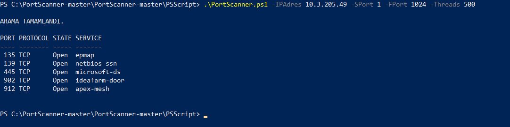
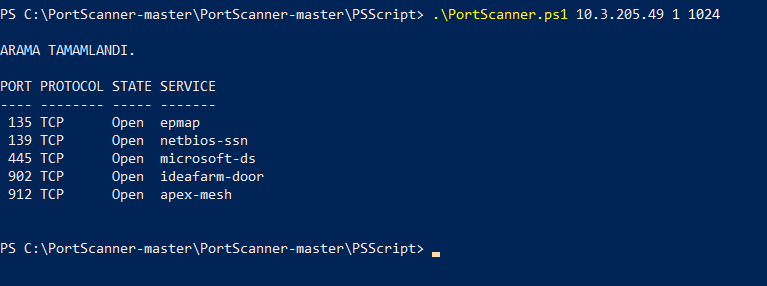

# PortScanner
Script 4 tane parametreye sahiptir. Bu parametreler IP adres, başlangıç port numarası, bitiş port numarası ve thread sayısını belirleyen parametrelerdir.
IP adresi hariç geri kalan bütün parametreler optionaldır ve kodun içinde default değerlerini görebilirsiniz.
Kısaca bu kod şöyle çalışır; verilen IP adresinde bütün portlarına tcp sorgusu yapar eğer timeout süresince cevap gelirse o portun açık olduğu bilgisine ulaşırız.
Bu portun hangi servise ait olduğunu bulmak için aşağıdaki xmli invoke ederek bir txt dosyası oluşturdum. (PortServisleri/ports.txt burada portları ve servisleri görebilirsiniz.) https://www.iana.org/assignments/service-names-port-numbers/service-names-port-numbers.xml

Daha sonra scriptin başında bu portları ve servisleri kullanarak bir hashtable veri yapısı oluşturdum.
Açık olan portları buldukça bu veri yapısını kullanarak servis sonuçlarını döndürdüm. Tabii her bir porta ping atıp beklemek uzun sürdüğü için threadleri kullanarak scan işlemini minimalize etmeye çalıştım.(Tüm portları sorgulaması 500 thread ile benim bilgisayarımda 4-5 dk kadar sürmektedir.) Thread sayısını parametre olarak vererek bu süreyi siz de kendiniz ayarlayabilirsiniz. Ayrıca bu script xml ve txt formatında olmak üzere iki tür raporlama yapmaktadır ve bu raporları rapor kalsörlerinin içine tarihleriyle birlikte kaydetmektedir.

Kodun nasıl çalıştırıldığını görmek için aşağıdaki ekran görüntülerine bakmanız yeterlidir.

Yukarıda da bahsettiğim üzere IP adresi hariç tüm parametreler optionaldır. Yazmazsanız default değerleri kullanılır.
Raporlar için repositorydeki örnek çıktılara bakabilirsiniz.
